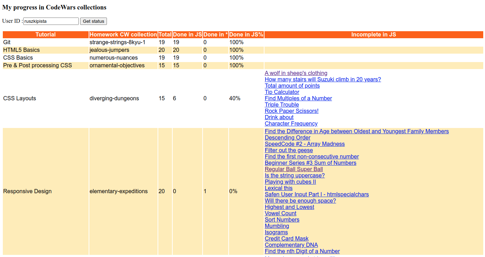

# Check progress in Codewars collections
Track progress of katas from given collections for a user, provide links to katas unfinished in JavaScript.

The collection names are hardcoded into [collections.json](https://github.com/ruszkipista/cw-status/blob/main/collections.json) file
